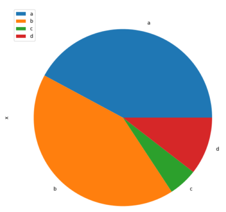
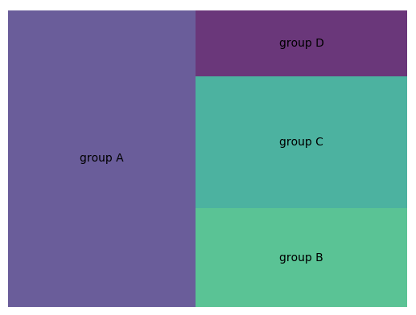
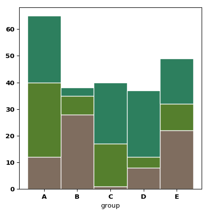
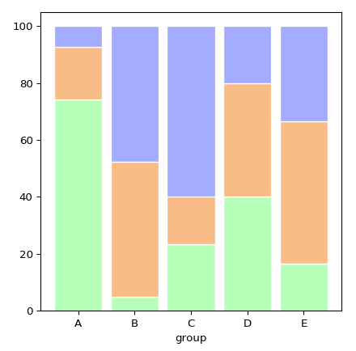

지역이름 검색별 이슈 키워드 통계 :city_sunrise:
========================== 
---
## 1. 설명

```
2020 경기도 데이터 산업인력 양성 사업의 빅데이터 전문가 과정 SEMI-PROJECT-1
경기도의 28개의 시와 3개의 군을 합친 31개의 도시를 검색하여 스크래핑한 이후 어떤 키워드가 많이 사용되는지 분석
```

## 2. 스크래핑한 채널

---
### - :green_book:Naver Blog    <허지훈> 

### - :camera:Instagram      <이채은> 

### - :newspaper:Naver News   <배지연>


## 3.  사용된 라이브러리

---

```
- selenium
- BeautifulSoup 
- konlpy
- collections
- time
- pandas
- numpy
- pickle
- json
- csv
- sys
```


## 4. 작업 도중 발생한 이슈들

---
>:green_book:Naver Blog    <허지훈> 
>>1. 블로그 내용 수집중 HTML내부가 Iframe으로 되어있어서 태그를 찾지 못했음
>>>=> 해결: Iframe에있는 src 경로로 다시 접근하여 scrapping 하였음   

>>2. 네이버 블로그는 많은 Frame이 있기 때문에 모든 블로그를 수집하지 못했음
>>>=> 해결: 1개의 틀만 정하고 잡아놓은 URL만 수집하였음 

>>3. 블로그 특성상 많은 양의 텍스트가 존재하여 서버가 자주 down됨
>>>=> 해결: Colab을 이용하여 도시를 나눠 분할작업 후 Pickle을 사용하여 데이터 저장함  
>>>=> Colab은 Ubuntu운영체제로 화면이 없기 때문에 브라우저를 띄우지않고 headless상태로 브라우저에 접속해야함 -> Selenium에 headless옵션 사용

>>4. 파일 용량이 커서 csv로 Parsing하여 저장할 때 Error발생함
>>>=> 해결: import csv      import sys          csv.field_size_limit(sys.maxsize) csv에 허용가능한 필드의 사이즈를 최대로 늘림

>>5. 파일 용량이 커서 1개의 csv로 merge를 하지 못했음 (메모리초과)
>>>=> 해결: 해결하지 못하여서 7개의 파일로 분할하여 작업함

## 5. 시각화 

---
### PiePlot



---
### Tree Map



---
### Stacked Barplot



---
### Percent Stacked Barplot




## 산출물

---
### - :green_book:Naver Blog    <허지훈> 
- 1.* 파일 { 가평군, 고양시,광명시, 광주시, 구리시, 군포시, 김포시 }
- 2.* 파일 { 남양주시, 동두천시, 부천시, 성남시, 과천시 }
- 3.* 파일 { 안양시, 양주시, 양평군, 여주시 }
- 4.* 파일 { 연천군, 오산시, 용이니, 의왕시 }
- 5.* 파일 { 의정부시, 이천시, 파주시, 평택시 }
- 6.* 파일 { 포천시, 하남시, 화성시 }
- 7.* 파일 { 수원시, 시흥시, 안산시, 안성시 }

### - :camera:Instagram      <이채은> 


### - :newspaper:Naver News   <배지연>


